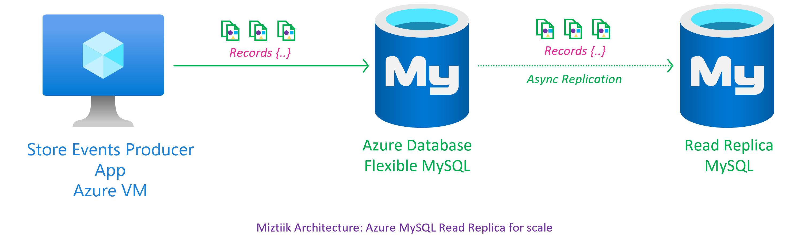
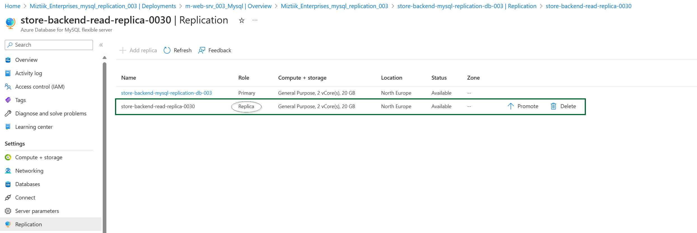
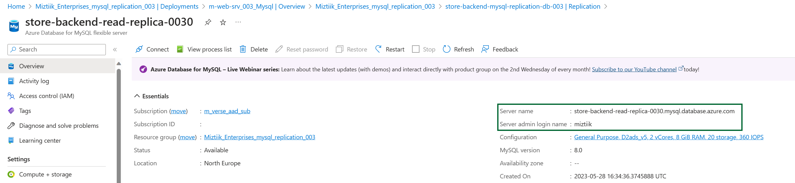

# Azure Database for Flexible MySQL with User Assigned Read Replica for better performance

A simple demonstration to improve the read performance of the database for reporting and anlaytics using Read Replicas

## 🎯 Solution



1. ## 🧰 Prerequisites

   This demo, along with its instructions, scripts, and Bicep template, has been specifically designed to be executed in the `northeurope` region. However, with minimal modifications, you can also try running it in other regions of your choice (the specific steps for doing so are not covered in this context)

   - 🛠 Azure CLI Installed & Configured - [Get help here](https://learn.microsoft.com/en-us/cli/azure/install-azure-cli)
   - 🛠 Azure Function Core Tools - [Get help here](https://learn.microsoft.com/en-us/azure/azure-functions/functions-run-local?tabs=v4%2Cwindows%2Ccsharp%2Cportal%2Cbash#install-the-azure-functions-core-tools)
   - 🛠 Bicep Installed & Configured - [Get help here](https://learn.microsoft.com/en-us/azure/azure-resource-manager/bicep/install)
     - 🛠 [Optional] VS Code & Bicep Extenstions - [Get help here](https://learn.microsoft.com/en-us/azure/azure-resource-manager/bicep/install#vs-code-and-bicep-extension)
   - `jq` - [Get help here](https://stedolan.github.io/jq/download/)
   - `bash` or git bash - [Get help here](https://git-scm.com/downloads)

2. ## ⚙️ Setting up the environment

   - Get the application code

     ```bash
     git clone https://github.com/miztiik/azure-web-server-to-mysql.git
     cd azure-web-server-to-mysql
     ```

3. ## 🚀 Prepare the local environment

   Ensure you have jq, Azure Cli and bicep working

   ```bash
   jq --version
   func --version
   bicep --version
   bash --version
   az account show
   ```

4. ## 🚀 Deploying the Solution

   - **Stack: Main Bicep**
     The params required for the modules are in `params.json`. Modify them as needed. The helper deployment script `deploy.sh` will deploy the `main.bicep` file. This will create the following resoureces
     - Resource Group(RG)
     - VNet, Subnet & Virtual Machine
     - Virtual Machine(Ubuntu) - `1` - Defined in `params.json` named `vmCount`
        - Bootstrapped with custom libs using `userData` script - Installs Nginx
        - Install Azure Monitoring Agent
     - User Managed Identity - Identity attached to the VM with the following permissions,
        - Monitoring Metrics Publisher
     - Azure Database for MySQL Server - Flexible
        - Admin User
        - Admin Password
        - SQL Version  - `8.0`
        - **Apparently Northeurope doesn't support high availability for Flexible servers as of Q2-2023**
     - Read Replica - Same config as the Primary.

     **Note** - I hacked the template from another repo of mine, so you will see some unused resources(log analytics workspace/queues etc.,). _You can safely ignore them, But do remember to clean up your Resource Group to avoid unnecessary costs._

    ```bash
    # make deploy
    sh deployment_scripts/deploy.sh
    ```

     After successfully deploying the stack, Check the `Resource Groups/Deployments` section for the resources.

5. ## 🔬 Testing the solution

   - Login to your VM, You can find the public IP address in the resource blade. You can also get it from the Azure Portal. _You may also try connecting to the database from local machine if you have mysql client, In this case, lets use the Azure VM as it is already bootstrapped with the mysql client_

     ```bash
     ssh miztiik@<PUBLIC_IP_ADDRESS>
     ```

   - You can find the Primary Database Server name from the  resource blade.

   

   

      ```bash
      #!/bin/bash

      HOST='store-backend-mysql-replication-db-003.mysql.database.azure.com'
      PORT=3306
      USERNAME='miztiik'
      PASSWORD=''

      REPLICA_NAME="store-backend-read-replica-0030.mysql.database.azure.com"


      # Database and Table Details
      DATABASE="miztiik_store_backend_db"
      TABLE="store_events"

      # Maximum record count for the for loop
      RECORD_COUNT=10

      # Connect to MySQL and create database
      mysql -h "$HOST" -P "$PORT" -u "$USERNAME" -p"$PASSWORD" <<EOF
      CREATE DATABASE $DATABASE;
      EOF

      # Switch to the newly created database
      mysql -h "$HOST" -P "$PORT" -u "$USERNAME" -p"$PASSWORD" -e "USE $DATABASE;"

      # Create table
      mysql -h "$HOST" -P "$PORT" -u "$USERNAME" -p"$PASSWORD" -e "CREATE TABLE IF NOT EXISTS $DATABASE.$TABLE (id INT PRIMARY KEY, ts TIMESTAMP, msg VARCHAR(255));"

      # Insert records using for loop
      for ((i=1; i<=RECORD_COUNT; i++))
      do
      RANDOM_INCREMENT=$((RANDOM % 10 + 1))
      MESSAGE="Hello World from Miztiiik $RANDOM_INCREMENT"
      mysql -h "$HOST" -P "$PORT" -u "$USERNAME" -p"$PASSWORD" -e "INSERT INTO $DATABASE.$TABLE (id, ts, msg) VALUES ($i, CURRENT_TIMESTAMP, '$MESSAGE');"
      done

      # Verify inserted records
      mysql -h "$HOST" -P "$PORT" -u "$USERNAME" -p"$PASSWORD" -e "SELECT * FROM $DATABASE.$TABLE;"
      ```

      **Connect to the Replica**

      ```bash
      # Retrieve from read replica
      mysql -h "$REPLICA_NAME" -P "$PORT" -u "$USERNAME" -p"$PASSWORD" -e "SELECT * FROM $DATABASE.$TABLE;"
      ```

      You can also try the same SQL Workbench or any other MySQL client.

      ```bash
      root@m-web-srv-mysql-replication-003-0:~# mysql -h "$REPLICA_NAME" -P "$PORT" -u "$USERNAME" -e "SELECT * FROM $DATABASE.$TABLE;" -p
      Enter password:
      +----+---------------------+-----------------------------+
      | id | ts                  | msg                         |
      +----+---------------------+-----------------------------+
      |  1 | 2023-05-28 16:46:13 | Hello World from Miztiiik 2 |
      |  2 | 2023-05-28 16:46:13 | Hello World from Miztiiik 9 |
      |  3 | 2023-05-28 16:46:13 | Hello World from Miztiiik 9 |
      |  4 | 2023-05-28 16:46:13 | Hello World from Miztiiik 6 |
      |  5 | 2023-05-28 16:46:13 | Hello World from Miztiiik 2 |
      |  6 | 2023-05-28 16:46:13 | Hello World from Miztiiik 4 |
      |  7 | 2023-05-28 16:46:13 | Hello World from Miztiiik 1 |
      |  8 | 2023-05-28 16:46:13 | Hello World from Miztiiik 9 |
      |  9 | 2023-05-28 16:46:13 | Hello World from Miztiiik 9 |
      | 10 | 2023-05-28 16:46:13 | Hello World from Miztiiik 2 |
      +----+---------------------+-----------------------------+
      root@m-web-srv-mysql-replication-003-0:~#
      ```

      **Check Replication Lag** - We are looking for `Seconds_Behind_Source` value. Anything greater than `0` indicates lag.

      ```sql
       mysql> SHOW SLAVE STATUS\G;
       *************************** 1. row ***************************
                      Slave_IO_State:
                         Master_Host: store-backend-mysql-replication-db-003.mysql.database.azure.com
                         Master_User: az00b30d89d55f64
                         Master_Port: 3306
                      Connect_Retry: 60
                   Master_Log_File: mysql-bin.000001
                Read_Master_Log_Pos: 3603
                      Relay_Log_File: relay_bin-azure_group_sync.000002
                      Relay_Log_Pos: 4199
             Relay_Master_Log_File: mysql-bin.000001
                   Slave_IO_Running: No
                   Slave_SQL_Running: Yes
                   Replicate_Do_DB:
                Replicate_Ignore_DB:
                Replicate_Do_Table:
             Replicate_Ignore_Table: mysql.plugin
             Replicate_Wild_Do_Table:
       Replicate_Wild_Ignore_Table: mysql.\_\_%
                         Last_Errno: 0
                         Last_Error:
                      Skip_Counter: 0
                Exec_Master_Log_Pos: 7385
                   Relay_Log_Space: 157
                   Until_Condition: None
                      Until_Log_File:
                      Until_Log_Pos: 0
                Master_SSL_Allowed: Yes
                Master_SSL_CA_File: /app/work/azure_mysqlservice.pem
                Master_SSL_CA_Path:
                   Master_Server_Id: 0
                         Master_UUID:
                   Master_Info_File: mysql.slave_master_info
                         SQL_Delay: 0
                SQL_Remaining_Delay: NULL
             Slave_SQL_Running_State: Replica has read all relay log; waiting for more updates
                Master_Retry_Count: 86400
                         Master_Bind:
             Last_IO_Error_Timestamp:
          Last_SQL_Error_Timestamp:
                      Master_SSL_Crl:
                Master_SSL_Crlpath:
                Retrieved_Gtid_Set:
                   Executed_Gtid_Set:
                      Auto_Position: 0
                Replicate_Rewrite_DB:
                      Channel_Name: azure_group_sync
                Master_TLS_Version:
             Master_public_key_path:
             Get_master_public_key: 0
                   Network_Namespace:
       1 row in set, 1 warning (0.00 sec)

       ERROR:
       No query specified

       mysql> SHOW REPLICA STATUS\G;
       *************************** 1. row ***************************
                   Replica_IO_State: 
                         Source_Host: store-backend-mysql-replication-db-003.mysql.database.azure.com
                         Source_User: az00b30d89d55f64
                         Source_Port: 3306
                      Connect_Retry: 60
                   Source_Log_File: mysql-bin.000001
                Read_Source_Log_Pos: 3603
                      Relay_Log_File: relay_bin-azure_group_sync.000002
                      Relay_Log_Pos: 4199
             Relay_Source_Log_File: mysql-bin.000001
                Replica_IO_Running: No
                Replica_SQL_Running: Yes
                   Replicate_Do_DB:
                Replicate_Ignore_DB:
                Replicate_Do_Table:
             Replicate_Ignore_Table: mysql.plugin
             Replicate_Wild_Do_Table:
       Replicate_Wild_Ignore_Table: mysql.\_\_%
                         Last_Errno: 0
                         Last_Error:
                      Skip_Counter: 0
                Exec_Source_Log_Pos: 7385
                   Relay_Log_Space: 157
                   Until_Condition: None
                      Until_Log_File:
                      Until_Log_Pos: 0
                Source_SSL_Allowed: Yes
                Source_SSL_CA_File: /app/work/azure_mysqlservice.pem
                Source_SSL_CA_Path:
                   Source_SSL_Cert: /app/work/azure_mysqlclient_cert.pem
                   Source_SSL_Cipher:
                      Source_SSL_Key: /app/work/azure_mysqlclient_key.pem
             Seconds_Behind_Source: 0
       Source_SSL_Verify_Server_Cert: No
                      Last_IO_Errno: 0
                      Last_IO_Error:
                      Last_SQL_Errno: 0
                      Last_SQL_Error:
       Replicate_Ignore_Server_Ids:
                   Source_Server_Id: 0
                         Source_UUID:
                   Source_Info_File: mysql.slave_master_info
                         SQL_Delay: 0
                SQL_Remaining_Delay: NULL
          Replica_SQL_Running_State: Replica has read all relay log; waiting for more updates
                Source_Retry_Count: 86400
                         Source_Bind:
             Last_IO_Error_Timestamp:
          Last_SQL_Error_Timestamp:
                      Source_SSL_Crl:
                Source_SSL_Crlpath:
                Retrieved_Gtid_Set:
                   Executed_Gtid_Set:
                      Auto_Position: 0
                Replicate_Rewrite_DB:
                      Channel_Name: azure_group_sync
                Source_TLS_Version:
             Source_public_key_path:
             Get_Source_public_key: 0
                   Network_Namespace:
       1 row in set (0.00 sec)

       ERROR:
       No query specified
      ```

6. ## 📒 Conclusion

   In this demonstration, we have shown how to use read replicas to improve performance of Flexible Mysql from Azure VM.
  
7. ## 🧹 CleanUp

   If you want to destroy all the resources created by the stack, Execute the below command to delete the stack, or _you can delete the stack from console as well_

   - Resources created during [Deploying The Solution](#-deploying-the-solution)
   - _Any other custom resources, you have created for this demo_

   ```bash
   # Delete from resource group
   az group delete --name Miztiik_Enterprises_xxx --yes
   # Follow any on-screen prompt
   ```

   This is not an exhaustive list, please carry out other necessary steps as maybe applicable to your needs.

## 📌 Who is using this

This repository aims to show how to Bicep to new developers, Solution Architects & Ops Engineers in Azure.

### 💡 Help/Suggestions or 🐛 Bugs

Thank you for your interest in contributing to our project. Whether it is a bug report, new feature, correction, or additional documentation or solutions, we greatly value feedback and contributions from our community. [Start here](/issues)

### 👋 Buy me a coffee

[](https://ko-fi.com/Q5Q41QDGK) Buy me a [coffee ☕][900].

### 📚 References

1. [Azure Docs: Just In Time Access][10]

### 🏷️ Metadata


**Level**: 100

[10]: https://learn.microsoft.com/en-us/azure/defender-for-cloud/just-in-time-access-usage

[100]: https://www.udemy.com/course/aws-cloud-security/?referralCode=B7F1B6C78B45ADAF77A9
[101]: https://www.udemy.com/course/aws-cloud-security-proactive-way/?referralCode=71DC542AD4481309A441
[102]: https://www.udemy.com/course/aws-cloud-development-kit-from-beginner-to-professional/?referralCode=E15D7FB64E417C547579
[103]: https://www.udemy.com/course/aws-cloudformation-basics?referralCode=93AD3B1530BC871093D6
[899]: https://www.udemy.com/user/n-kumar/
[900]: https://ko-fi.com/miztiik
[901]: https://ko-fi.com/Q5Q41QDGK